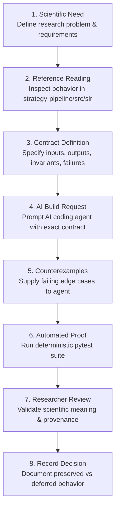

# AI-Built Scholar Search Kit Curriculum

This curriculum is for a scientific community learning to build research tools with AI. It does not teach syntax. It teaches how to specify a research capability, ask AI to implement it, evaluate the result, and preserve scientific accountability.

---

## The Repeatable AI-Build Loop

Every lesson follows this 8-step engineering and scientific loop:



---

## Curriculum Outline & Lesson Directory

### Chapter 1: The Research Problem & Architectural Foundations

* **Lesson 1.1**: *One Search Tool, Many Research Methods* — Scoping reviews, thesis research, citation mapping vs systematic literature reviews.
* **Lesson 1.2**: *What Makes a Search Reproducible?* — Search manifests, provenance tracking, query stability.
* **Lesson 1.3**: *Reading the Reference Implementation as Evidence* — Extracting contracts from `strategy-pipeline/src/slr`.
* **Lesson 1.4**: *Clean-Room Package Architecture* — `pyproject.toml`, layout, dependencies with `uv`.

### Chapter 2: Scientific Data Modeling & Invariants

* **Lesson 2.1**: [*Persistent Identifiers (`ExternalIds`)*](lessons/01-models-external-ids.md) — DOI regex stripping, arXiv ID, PMID, OpenAlex ID, S2 ID normalization.
* **Lesson 2.2**: [*The Normalized Document & Author Model*](lessons/02-models-author-document.md) — Canonical `Document`, `Author`, and `SearchResult` representations.
* **Lesson 2.3**: [*Query as a Research Instrument*](lessons/03-models-query.md) — Parameterized `Query` objects, filter bounds, language codes, stable query IDs.
* **Lesson 2.4**: [*Clusters & Non-Destructive Merging*](lessons/04-models-cluster.md) — `DocumentCluster`, confidence scoring, and multi-provider aggregations.

### Chapter 3: Resilience, Rate Limiting & Fault Tolerance

* **Lesson 3.1**: [*Exception Hierarchy for Resilient Search*](lessons/05-utils-exceptions.md) — `SearchException`, `ProviderError`, `RateLimitError`, `NetworkError`, `AuthenticationError`.
* **Lesson 3.2**: [*Rate Limiting with Token Buckets*](lessons/06-utils-rate-limiter.md) — `TokenBucket` algorithm, burst capacity, continuous refill, thread safety.
* **Lesson 3.3**: [*Exponential Backoff & Rate Limit Retries*](lessons/07-utils-retry.md) — `@retry_with_backoff`, `@retry_on_rate_limit`, dynamic HTTP 429 `Retry-After` header extraction.

### Chapter 4: Query Translation & Response Normalization

* **Lesson 4.1**: [*Query Lexing & Translation*](lessons/08-query-parser-translator.md) — `QueryParser`, `QueryToken`, `SimpleQueryTranslator`, `BooleanQueryTranslator`, `StructuredQueryTranslator`.
* **Lesson 4.2**: [*Response Normalization Subsystem*](lessons/09-normalization-subsystem.md) — `FieldExtractor`, `AuthorParser`, `DateParser`, `IDExtractor`, `ResponseNormalizer`.

### Chapter 5: Provider Subsystem & Ingestion Pipelines

* **Lesson 5.1**: [*The Provider Protocol & In-Memory Engine*](lessons/10-providers-base-and-in-memory.md) — `SearchProvider` Protocol, `BaseProvider`, `InMemoryProvider`, `ProviderRegistry`.
* **Lesson 5.2**: [*Ingesting OpenAlex at Scale*](lessons/11-providers-openalex.md) — REST API, cursor pagination, polite pool `mailto`, inverted index abstract decompression.
* **Lesson 5.3**: [*Ingesting Crossref DOIs & Metadata*](lessons/12-providers-crossref.md) — REST API, deep cursor pagination, polite pool `mailto`, `issued.date-parts` parsing.
* **Lesson 5.4**: [*Ingesting arXiv Preprints & Atom XML*](lessons/13-providers-arxiv.md) — Atom XML namespaces, field query expansion, 10k offset cap, client-side year filtering.
* **Lesson 5.5**: [*Ingesting Semantic Scholar Bulk Search*](lessons/14-providers-semantic-scholar.md) — Bulk API, continuation tokens, Boolean operator rewriting (`AND` $\rightarrow$ `+`, `OR` $\rightarrow$ `|`).

### Chapter 6: Deduplication & Canonical Representation

* **Lesson 6.1**: [*4-Phase Conservative Deduplication*](lessons/15-dedup-conservative-strategy.md) — Exact DOI index $\rightarrow$ exact arXiv $\rightarrow$ fuzzy title ($\ge 97\%$) + year gap.
* **Lesson 6.2**: [*Representative Selection & Deduplication Metrics*](lessons/15-dedup-conservative-strategy.md#2-implementation-tiers) — Canonical document scoring tuple, duplicate rate, cluster distribution.

### Chapter 7: Exporters & Research Record Artifacts

* **Lesson 7.1**: [*Exporting to CSV, JSON & JSONL*](lessons/16-export-csv-jsonl.md) — `BaseExporter`, `CSVExporter` (flattened/clusters), `JSONLExporter` (streaming/nested).
* **Lesson 7.2**: [*Exporting to BibTeX for Citation Managers*](lessons/17-export-bibtex.md) — `BibTeXExporter`, cite key generation (`FirstAuthorYYYYKeyword`), LaTeX escaping.

### Chapter 8: CLI, Harness Integration & Agentic Tooling

* **Lesson 8.1**: [*The CLI as an Agent Tool & Manifests*](lessons/18-cli-tooling-and-manifests.md) — `init`, `search`, `deduplicate`, `export`, `metadata.json`, `prisma_counts.json`.
* **Lesson 8.2**: [*Harness Adapter & Agent Tool Execution*](lessons/19-harness-adapter-and-agent-tools.md) — `DeduplicateDocumentsStage`, permissions, approval gates, MCP runtime.

---

## Standard AI Build Request Template

For every lesson, use the following standardized prompt template to instruct an AI coding agent:

```text
You are implementing component <ComponentName> for Scholar Search Kit.

Scientific Purpose:
<What research problem this component solves>

Reference Behavior:
<Observed behavior from strategy-pipeline/src/slr/...>

Contract:
- Inputs: <Typed inputs>
- Outputs: <Typed outputs>
- Invariants: <Invariants and rules that must never be broken>
- Failure Behavior: <Exceptions to raise or fallback strategies>

Counterexamples:
- <Edge case 1: e.g. case-insensitive DOI prefix stripping>
- <Edge case 2: e.g. unclosed parenthesis or empty inverted index>

Constraints:
- Preserve provenance;
- Do not invent missing metadata;
- Zero network access for unit tests;
- Provide deterministic pytest cases.

Before editing, summarize the design and specify at least one falsifying test.
Then implement the component, execute the focused tests, and report limitations.
```
