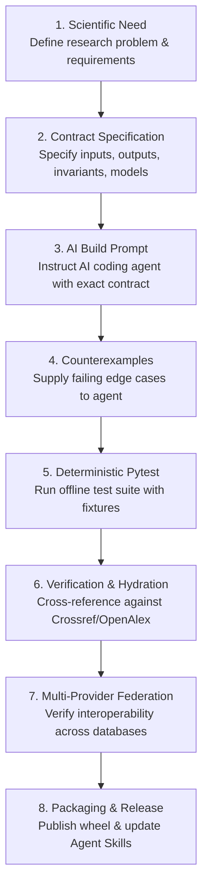

# AI-Built Scholar Search Kit Curriculum

This curriculum teaches researchers and engineers how to build, test, and maintain high-precision literature discovery and ingestion tooling with AI coding assistants.

---

## The Repeatable AI-Build Loop

Every lesson follows this 8-step engineering and scientific loop:

---

## Curriculum Outline & Lesson Directory

### Chapter 1: The Research Problem & Architectural Foundations
* **Lesson 1.1**: *One Search Tool, Many Research Methods* — Scoping reviews, thesis research, and citation mapping.
* **Lesson 1.2**: *What Makes a Search Reproducible?* — Search manifests, provenance tracking, and query stability.
* **Lesson 1.3**: *Clean-Room Package Architecture* — `pyproject.toml`, layout, and dependencies with `uv`.

### Chapter 2: Scientific Data Modeling & Invariants
* **Lesson 2.1**: [*Persistent Identifiers (`ExternalIds`)*](lessons/01-models-external-ids.md) — DOI regex stripping, arXiv ID, PMID, OpenAlex ID, S2 ID normalization.
* **Lesson 2.2**: [*The Normalized Document & Author Model*](lessons/02-models-author-document.md) — Canonical `Document`, `Author`, and `SearchResult` representations.
* **Lesson 2.3**: [*Query as a Research Instrument*](lessons/03-models-query.md) — Parameterized `Query` objects, filter bounds, and stable query IDs.
* **Lesson 2.4**: [*Clusters & Non-Destructive Merging*](lessons/04-models-cluster.md) — `DocumentCluster`, confidence scoring, and multi-provider aggregations.

### Chapter 3: Resilience, Rate Limiting & Caching
* **Lesson 3.1**: [*Exception Hierarchy for Resilient Search*](lessons/05-utils-exceptions.md) — `ScholarSearchError`, `ProviderError`, `RateLimitExceededError`, `InvalidQueryError`, `VerificationError`.
* **Lesson 3.2**: [*Rate Limiting with Token Buckets*](lessons/06-utils-rate-limiter.md) — Token bucket algorithm, polite pool headers, and continuous refill.
* **Lesson 3.3**: [*Exponential Backoff, SQLite Caching, & Timeouts*](lessons/07-utils-retry.md) — `AcademicHttpClient`, SQLite caching, 30s timeouts, and retry adapters.

### Chapter 4: Query Lexing & Response Normalization
* **Lesson 4.1**: [*Query Lexing & Translation*](lessons/08-query-parser-translator.md) — `QueryParser`, `QueryToken`, and `BooleanQueryTranslator`.
* **Lesson 4.2**: [*Response Normalization Subsystem*](lessons/09-normalization-subsystem.md) — Parsing authors, publication dates, and cleaning abstracts.

### Chapter 5: Provider Subsystem & Ingestion Pipelines
* **Lesson 5.1**: [*The Provider Protocol & Multi-Provider Engine*](lessons/10-providers-base-and-in-memory.md) — `SearchProvider` Protocol, `BaseProvider`, and `SearchEngine`.
* **Lesson 5.2**: [*Ingesting OpenAlex & Citation Snowballing*](lessons/11-providers-openalex.md) — Cursor pagination, abstract inverted indices, and forward/backward snowballing.
* **Lesson 5.3**: [*Ingesting Crossref DOIs & Reference Validation*](lessons/12-providers-crossref.md) — Crossref works API, polite mailto, and bibliographic validation.
* **Lesson 5.4**: [*Ingesting arXiv Preprints & Atom XML*](lessons/13-providers-arxiv.md) — Atom XML namespaces, field query expansion, and arXiv ID extraction.
* **Lesson 5.5**: [*Ingesting Semantic Scholar Bulk Search*](lessons/14-providers-semantic-scholar.md) — Bulk API, continuation tokens, and graph endpoints.

### Chapter 6: Deduplication & Verification Engine
* **Lesson 6.1**: [*Multi-Provider Deduplication & Smart Metadata Merging*](lessons/15-dedup-conservative-strategy.md) — Exact ID matching + fuzzy title matching with year gating + metadata merging.
* **Lesson 6.2**: [*Document Verification & Hallucination Detection*](lessons/15b-verification-and-hallucination-detection.md) — Cross-referencing against Crossref's 150M records and OpenAlex hydration.

### Chapter 7: Exporters & Research Record Artifacts
* **Lesson 7.1**: [*Exporting & Importing JSON, JSONL, CSV & RIS*](lessons/16-export-csv-jsonl.md) — `Exporter`, `RISImporter`, `JSONImporter`, and `JSONLImporter`.
* **Lesson 7.2**: [*Exporting to BibTeX for Citation Managers*](lessons/17-export-bibtex.md) — `BibTeXExporter`, cite key generation, and LaTeX escaping.

### Chapter 8: CLI, Agent Skills & Ecosystem Integration
* **Lesson 8.1**: [*Modern Typer CLI & Workflow Automation*](lessons/18-cli-tooling-and-manifests.md) — `search`, `snowball`, `import`, `dedup`, and `export` subcommands.
* **Lesson 8.2**: [*Agentic Skills & Multi-Tool Coordination*](lessons/19-harness-adapter-and-agent-tools.md) — Antigravity `.agents/skills/scholar-search-kit/SKILL.md` and `scholar-pdf-kit` interoperability.
