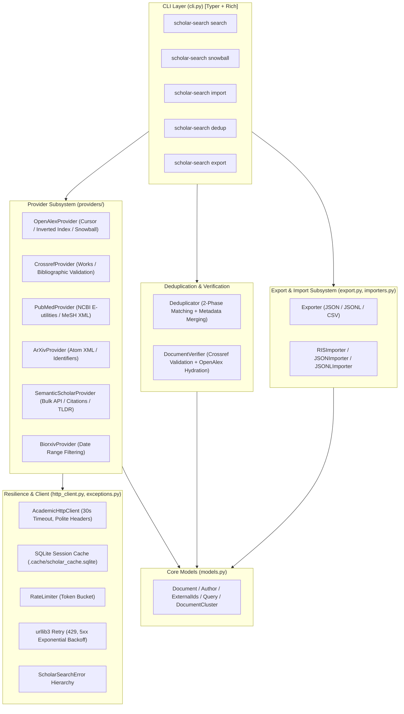

# Scholar Search Kit: Master Component Specifications

This document is the master technical and architectural specification for **Scholar Search Kit**. It defines the component contracts, data models, resilience mechanics, query translation rules, provider behaviors, deduplication pipelines, verification engine, export adapters, and Typer CLI.

---

## 1. System Architecture Overview

---

## 2. Core Data Models (`models.py`)

### 2.1 `ExternalIds`
* **Fields**: `doi: str | None`, `arxiv_id: str | None`, `pubmed_id: str | None`, `openalex_id: str | None`, `s2_id: str | None`.
* **Invariants**:
  - Automatically strips URL prefixes (`https://doi.org/`, `http://dx.doi.org/`) and `doi:` URNs.
  - Automatically strips `arxiv:` prefixes.
  - Trims whitespace and normalizes empty strings to `None`.

### 2.2 `Author`
* **Fields**: `family_name: str`, `given_name: str | None`, `orcid: str | None`.
* **Property**: `full_name -> str` (e.g. `"Alan Turing"` or `"Euclid"`).

### 2.3 `Document`
* **Fields**: `title`, `year`, `provider`, `provider_id`, `external_ids`, `abstract`, `authors`, `venue`, `url`, `citations_count`, `references_count`, `citation_intents`, `mesh_terms`, `tldr`, `query_id`, `retrieved_at`, `cluster_id`, `raw_data`.
* **Methods**: `mark_retrieved()` assigns UTC timestamp.

### 2.4 `Query`
* **Fields**: `text`, `id = "Q001"`, `year_min`, `year_max`, `language = "en"`, `max_results`.

### 2.5 `DocumentCluster`
* **Fields**: `cluster_id: int`, `representative: Document`, `members: list[Document]`.
* **Properties**: `size -> int`, `confidence -> float` (`1.0` if persistent identifier exists, else `0.95`).

---

## 3. Resilience & HTTP Layer (`http_client.py`, `exceptions.py`)

* **Exceptions**: `ScholarSearchError` $\rightarrow$ `ProviderError` (with `RateLimitExceededError`), `InvalidQueryError`, `VerificationError`.
* **`RateLimiter`**: Token bucket algorithm regulating outbound requests to comply with provider terms of service.
* **`AcademicHttpClient`**:
  - SQLite response cache in `.cache/scholar_cache.sqlite` with 30-day default expiration.
  - Automatic exponential backoff retries (factor 2.0) on 429, 500, 502, 503, 504.
  - Default 30s socket timeout.
  - Polite pool `mailto` header injection.

---

## 4. Provider Subsystem (`providers/`)

1. **OpenAlex**: Cursor-based streaming pagination, inverted-index abstract reconstruction, forward and backward snowballing (`filter=cites:...`).
2. **Crossref**: Bibliographic reference validation (`query.bibliographic`), published DOI resolution.
3. **PubMed**: NCBI E-utilities (`esearch` + `efetch`), XML parsing, and MeSH heading extraction.
4. **arXiv**: Atom XML parsing, query code expansion (`ti:`, `abs:`), sanitized identifier extraction.
5. **Semantic Scholar**: Bulk search endpoint with continuation tokens, citation graph traversal, and AI TLDR summaries.
6. **bioRxiv**: Chronological preprint window queries with local metadata filtering.

---

## 5. Deduplication & Verification (`dedup.py`, `verifier.py`)

* **`Deduplicator`**:
  - Phase 1: Exact matching across all persistent identifier types (`doi`, `arxiv_id`, `pubmed_id`, `openalex_id`, `s2_id`).
  - Phase 2: Fuzzy title similarity ($\ge 0.95$) with publication year gap gating ($|y_1 - y_2| \le 1$).
  - Non-destructive metadata synthesis: Merges abstracts, authors, MeSH terms, TLDRs, and citation counts into the canonical representative.
* **`DocumentVerifier`**:
  - `verify_by_doi()` and `verify_by_title()`: Cross-checks records against Crossref's 150M records to detect LLM hallucinations.
  - `hydrate_metadata()`: Backfills missing abstract text, venues, and citation statistics via OpenAlex.

---

## 6. Exporters & Importers (`export.py`, `importers.py`)

* **Exporters**: `Exporter.json()` (standard JSON array), `Exporter.jsonl()` (streaming lines), `Exporter.csv()` (flattened tabular).
* **Importers**: `RISImporter.import_file()` (standard `.ris`), `JSONImporter.import_file()` (JSON arrays), `JSONLImporter.import_file()` (line-delimited JSON).

---

## 7. Modern Typer CLI (`cli.py`)

* **`scholar-search search`**: Federated multi-provider literature retrieval.
* **`scholar-search snowball`**: Citation network forward and backward traversal.
* **`scholar-search import`**: Ingest RIS/JSON/JSONL files with optional `--verify` and `--enrich` flags.
* **`scholar-search dedup`**: Standalone deduplication of search datasets.
* **`scholar-search export`**: Format conversion between JSON, JSONL, and CSV.
