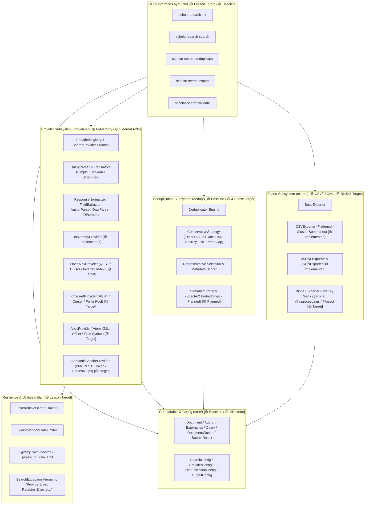

# Scholar Search Kit: Master Component Specifications

This document is the master technical and architectural specification for **Scholar Search Kit** (and its reference counterpart in `strategy-pipeline/src/slr`). It provides design contracts, data models, resilience mechanics, query translation rules, provider-specific endpoint behaviors, deduplication pipelines, export adapters, and CLI interfaces.

---

## 1. Status & Implementation Tiers

Every component in this document is labeled with one of the following implementation tiers:

| Status Badge | Meaning | Current Code Location |
| :--- | :--- | :--- |
| **`[🟢 Implemented v0.1.0]`** | Implemented, active in codebase, verified by passing unit tests. | `src/scholar_search/` |
| **`[🟡 Lesson Milestone Target]`** | Target contract for upcoming AI-assisted construction lessons. | Detailed in `docs/lessons/` |
| **`[🔵 Reference Architecture]`** | Implemented in `strategy-pipeline/src/slr`, serving as reference inspiration. | `strategy-pipeline/src/slr/` |
| **`[🟣 Production Target]`** | Future enhancement (e.g. semantic embeddings, ML classifiers). | Design placeholder |

---

## 2. System Architecture Overview

---

## 3. Core Data Models

### 3.1 `ExternalIds` `[🟢 Implemented v0.1.0 / 🟡 Extended IDs Target]`

* **Purpose**: Store and normalize academic persistent identifiers across distributed repositories.
* **Fields in v0.1.0**:
  * `doi`: `Optional[str] = None`
  * `arxiv_id`: `Optional[str] = None`
  * `pubmed_id`: `Optional[str] = None`
* **Fields in Milestone Target**:
  * `openalex_id`: `Optional[str] = None`
  * `s2_id`: `Optional[str] = None`
* **Normalization Invariants**:
  * Strips regex `^https?://(dx\.)?doi\.org/` and `^doi:\s*` (case-insensitive).
  * Trims and lowercases: `https://doi.org/10.1000/182_TEST` $\rightarrow$ `10.1000/182_test`.
  * arXiv ID strips leading `arxiv:` or `arXiv:`.
  * Empty strings (`""`) or whitespace convert to `None`.

### 3.2 `Author` `[🟢 Implemented v0.1.0]`

* **Fields**:
  * `family_name`: `str` (required).
  * `given_name`: `Optional[str] = None`.
  * `orcid`: `Optional[str] = None` (normalized without URL prefix).
* **Properties**:
  * `full_name -> str`: `f"{given_name} {family_name}"` if `given_name` present, else `family_name`.

### 3.3 `Document` `[🟢 Implemented v0.1.0 / 🟡 Extended Provenance Target]`

* **Fields in v0.1.0**:
  `title` (required), `year`, `provider`, `provider_id`, `external_ids`, `abstract`, `authors`, `venue`, `url`, `query_id`, `retrieved_at` (UTC datetime), `cluster_id`, `raw_data`.
* **Fields in Milestone Target**:
  `language: Optional[str]`, `cited_by_count: Optional[int]`, `query_text: Optional[str]`.

### 3.4 `Query` `[🟢 Implemented v0.1.0 / 🟡 Metadata Target]`

* **Fields in v0.1.0**:
  `text` (required), `id = "Q001"`, `year_min`, `year_max`, `language = "en"`, `max_results`.
* **Fields in Milestone Target**:
  `metadata: Dict[str, Any]` (arbitrary context for linking to research questions or protocols).

### 3.5 `DocumentCluster` `[🟢 Implemented v0.1.0 / 🟡 Match Method Target]`

* **Fields in v0.1.0**:
  `cluster_id: int`, `representative: Document`, `members: List[Document]`.
* **Fields in Milestone Target**:
  `all_dois: List[str]`, `all_arxiv_ids: List[str]`, `provider_counts: Dict[str, int]`, `match_method: Optional[str]`.
* **Scientific Note on Confidence Metric**:
  * `confidence` (or `match_evidence_score`) returns a heuristic score ($1.0$ for exact persistent ID matches; $0.95$ for conservative title similarity).
  * **Scientific Caution**: Heuristic confidence scores are not calibrated Bayesian probabilities. In research publications, deduplication decisions should be audited using explicit `match_method` records (`exact_doi`, `exact_arxiv_id`, `fuzzy_title`).

---

## 4. Resilience & Fault Tolerance Subsystem `[🟡 Lesson Milestone Target]`

### 4.1 `TokenBucket` Rate Limiter

* **Mathematical Refill Model**:
  $$\text{tokens}(t) = \min\Big(\text{capacity},\ \text{tokens}(t_{last}) + (t - t_{last}) \times \text{rate}\Big)$$
* **Capacity Invariant**: $C = \lfloor \text{rate} \times 5 \rfloor$ (permits initial burst for page requests).
* **Compliance Note**: Client-side rate limiters reduce client-generated rate limit violations. However, servers may enforce IP-wide concurrency caps or dynamic throttling; robust code must pair client rate limiting with HTTP 429 backoff handling.

### 4.2 Retry with Exponential Backoff (`@retry_with_backoff`)

* **Delay Formula**:
  $$d_i = \min(\text{base\_delay} \times \text{backoff\_factor}^i,\ \text{max\_delay})$$
* **Dynamic Header Extraction (`@retry_on_rate_limit`)**:
  * Inspects HTTP 429 `Retry-After` response header and sleeps for the server-specified duration.

### 4.3 Typed Exception Hierarchy

* Root: `SearchException` (or `SLRException` in reference).
* Subclasses: `ProviderError`, `RateLimitError` (`retry_after`), `AuthenticationError`, `NetworkError`, `DeduplicationError`, `ValidationError`, `ExportError`, `QueryError`.

---

## 5. Query Translation Subsystem `[🟡 Lesson Milestone Target]`

### 5.1 `QueryParser`

* **Lexer Rules**:
  * Quoted phrases: `"..."`
  * Field prefixes: `title:`, `author:`, `year:`, `venue:`, `doi:`
  * Boolean operators: `AND`, `OR`, `NOT` (case-insensitive)
  * Parentheses: `(` and `)` with balanced syntax validation.

### 5.2 Translators

* `SimpleQueryTranslator`: Plain query string passing for basic search.
* `BooleanQueryTranslator`: Maps tokens to provider field syntax and operator characters.
* `StructuredQueryTranslator`: Converts tokens to nested dictionary expressions (`$and`, `$or`, `$not`).

---

## 6. Provider Specifications `[🟢 In-Memory / 🟡 External APIs Target]`

### Staged 7-Step Checkpoints for Building Providers with AI

To ensure reliable, testable construction, each external provider is built in 7 incremental steps:

1. **Response Fixture**: Record or craft static sample response JSON/XML.
2. **Field Extraction**: Implement `FieldExtractor` paths for title, year, authors, IDs.
3. **Normalization**: Implement `_normalize_response()` converting raw items to `Document`.
4. **Query Translation**: Implement `_translate_query()` mapping `Query` to provider params.
5. **Pagination**: Implement cursor / token / offset loop in `search()`.
6. **Rate Limiting & Retries**: Wire `TokenBucket` and `@retry_with_backoff`.
7. **Integration & Mock Tests**: Deterministic unit test suite without live network calls.

### Provider Summary Table

| Provider | Endpoint | Rate Limit | Polite Pool | Pagination | Abstract Method | Status |
| :--- | :--- | :--- | :--- | :--- | :--- | :--- |
| **`InMemoryProvider`** | In-memory filter | Unlimited | N/A | Generator slice | Substring search | [🟢 Implemented v0.1.0] |
| **`OpenAlexProvider`** | `api.openalex.org/works` | 10 req/s | `mailto` | Cursor (`cursor=*`) | Inverted index decompression | [🟡 Lesson Milestone Target] |
| **`CrossrefProvider`** | `api.crossref.org/works` | 45–50 req/s | `mailto` | Deep cursor (`cursor=*`) | `issued.date-parts` year | [🟡 Lesson Milestone Target] |
| **`ArxivProvider`** | `export.arxiv.org/api/query` | 3 req/s | User-Agent | Offset (`start`, cap 10k) | Atom XML summary | [🟡 Lesson Milestone Target] |
| **`SemanticScholar`** | `api.semanticscholar.org/graph/v1/...` | 100 req/s | N/A | Token (`token=...`) | Bulk query syntax (`+`, `&#124;`, `-`) | [🟡 Lesson Milestone Target] |

---

## 7. Deduplication Subsystem `[🟢 Baseline / 🟡 4-Phase Target]`

### 7.1 Baseline Implementation (`v0.1.0`)

* **Behavior in `src/scholar_search/dedup.py`**:
  * Exact matching on DOI or arXiv ID.
  * Conservative title similarity via Python `difflib.SequenceMatcher.ratio() >= 0.97` on alphanumeric lowercased strings.

### 7.2 Milestone Target: 4-Phase Conservative Algorithm

1. **Title Normalization**: Unicode NFD decomposition, diacritics stripping ($é \rightarrow e$), whitespace normalization.
2. **Phase 1 (Exact DOI)**: Merges all unclustered records sharing identical normalized DOI (`confidence = 1.0`).
3. **Phase 2 (Exact arXiv ID)**: Merges all remaining unclustered records sharing identical arXiv ID (`confidence = 1.0`).
4. **Phase 3 (Fuzzy Title + Year Gap)**: Merges remaining unclustered records matching on normalized title if $|year_1 - year_2| \le \text{max\_year\_gap}$ (default: $1$).
5. **Phase 4 (Singletons)**: Assigns all remaining unique records to singleton clusters.

### 7.3 Canonical Representative Selection Formula

$$\text{Score}(d) = \Big( \text{Completeness}(d),\ \text{Citations}(d),\ \text{ProviderPriority}(d) \Big)$$

* $\text{Completeness}(d) = 10 \cdot \mathbb{I}(\text{abstract}) + 5 \cdot \mathbb{I}(\text{authors}) + 3 \cdot \mathbb{I}(\text{venue}) + 2 \cdot \mathbb{I}(\text{doi})$
* $\text{ProviderPriority}$: Crossref (4) > OpenAlex (3) > Semantic Scholar (2) > arXiv (1) > Unknown (0).

---

## 8. Export Subsystem `[🟢 CSV/JSONL / 🟡 BibTeX Target]`

### 8.1 Current Baseline Exporters (`export.py`)

* `csv(documents, output_file)`: Emits CSV with `title, year, provider, doi`.
* `jsonl(documents, output_file)`: Emits line-delimited JSON objects.

### 8.2 Milestone Target Exporters

* **`CSVExporter`**: Flattened columns including all author counts, external IDs, and cluster summary columns (`cluster_size`, `cluster_confidence`, `cluster_dois`, `cluster_providers`).
* **`JSONLExporter` / `JSONExporter`**: Supports `"representatives"`, `"all"`, and `"clusters"` (nested member arrays) modes.
* **`BibTeXExporter`**:
  * Citation Key Generation: `FirstAuthorYYYYKeyword` (e.g. `Vaswani2017Attention`).
  * Entry Type Resolution: `@article` (journals/DOIs), `@inproceedings` (conferences), `@misc` (arXiv preprints).
  * LaTeX Escaping: Replaces reserved characters (`\`, `&`, `%`, `$`, `#`, `_`, `{`, `}`, `~`, `^`).

---

## 9. CLI, Research Manifests & Harness Integration

### 9.1 CLI Command Suite `[🟢 Baseline / 🟡 Full Target]`

* **Baseline in `v0.1.0`**: `scholar-search deduplicate <titles...>`
* **Milestone Target**:
  * `scholar-search search --query "..." --provider openalex --output outputs/`
  * `scholar-search deduplicate --input outputs/ --strategy conservative`
  * `scholar-search export --input dedup/ --format bibtex --format csv`
  * `scholar-search validate --config config.yml`

### 9.2 Reproducibility Manifests

* **`metadata.json` (`SearchManifest`)**: Durable record of run ID, timestamp, exact query strings, provider versions, and result counts.
* **`prisma_counts.json` (Optional Review Reporting)**: Generates PRISMA 2020 flow counts for systematic review workflows without forcing every exploratory search into a formal PRISMA protocol.

### 9.3 Harness Stage Adapter `[🟢 Implemented]`

* **`DeduplicateDocumentsStage`** in `harness/scholar_search_integration.py`: Wraps `scholar_search.dedup.Deduplicator` and emits structured `StageResult` with metadata attribution.
