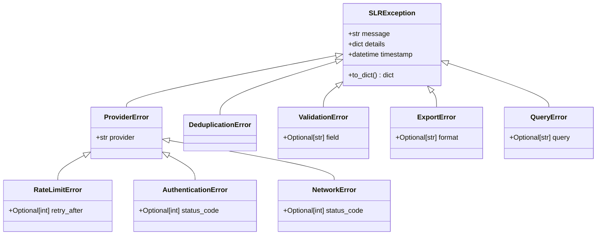

# Lesson 3.1: Exception Hierarchy for Resilient Search (`exceptions.py`)

## 1. Scientific Motivation & Context
Scholarly search involves querying multiple external APIs over the public internet. External failures are diverse: HTTP 429 rate limit spikes, HTTP 401/403 credential errors, 502/504 gateway timeouts, malformed responses, or XML parsing errors. Without a typed exception hierarchy, calling code cannot distinguish transient errors (which should be retried) from permanent authentication or query errors (which must halt immediately).

## 2. Reference Architecture Analysis
* **Reference Source**: `strategy-pipeline/src/slr/utils/exceptions.py`
* **Hierarchy Structure**:
  * `SLRException`: Base class with `message`, `details: Dict`, and `timestamp: datetime`.
  * `ProviderError`: Subclass with `provider: str`.
  * `RateLimitError`: Subclass of `ProviderError` with optional `retry_after: Optional[int]`.
  * `AuthenticationError`: Subclass of `ProviderError` with `status_code: Optional[int]`.
  * `NetworkError`: Subclass of `ProviderError` for socket timeouts / connection errors.
  * `DeduplicationError`, `ValidationError`, `ConfigurationError`, `ExportError`, `QueryError`.

## 3. Explicit Component Contract

### Class Hierarchy


### Invariants
1. **Serialization**: `SLRException.to_dict()` must return a JSON-serializable dictionary containing `type`, `message`, `details`, and ISO-formatted `timestamp`.
2. **Provider Context**: All `ProviderError` exceptions must prefix their string message with `f"[{provider}] ..."`.

## 4. Verification & Falsifying Tests

```python
from scholar_search.utils.exceptions import RateLimitError, SLRException

def test_rate_limit_error_context():
    err = RateLimitError(provider="crossref", message="Too many requests", retry_after=60)
    assert err.provider == "crossref"
    assert err.retry_after == 60
    assert "[crossref]" in str(err)
    
    d = err.to_dict()
    assert d["type"] == "RateLimitError"
    assert "timestamp" in d
```

## 5. AI Build Prompt

```text
Create scholar_search/utils/exceptions.py implementing the full SLR exception hierarchy according to Lesson 3.1.
Include SLRException, ProviderError, RateLimitError, AuthenticationError, NetworkError, DeduplicationError, ValidationError, ExportError, and QueryError.
Add unit tests in tests/test_exceptions.py.
```
