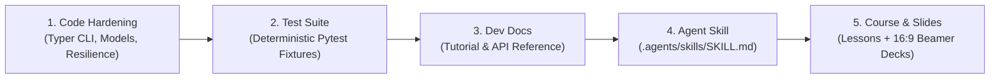

# Master Strategy: Nexus Scholar Suite & Academia Online Portal

This strategy document defines the authentic 6-toolkit ecosystem, the systematic hardening roadmap for remaining packages, and the deployment plan for the unified **Nexus Scholar Suite** developer portal and **Academia Course Platform** hosted under **`mouadh.org`** (or **`nexus.mouadh.org`**).

---

## 1. The Authentic 6-Toolkit Ecosystem

The **Nexus Scholar Suite** is designed around Unix philosophy, open data, and local LLMs to replace fragile manual literature reviews with auditable, agentic workflows:

| # | Toolkit | Core Responsibility | Status |
|---|---|---|---|
| 1 | **`scholar-search-kit`** | Federated discovery (OpenAlex, Crossref, arXiv, PubMed, bioRxiv, S2), 2-phase deduplication, and Crossref hallucination verification. | 🟢 Hardened & Documented (29 tests) |
| 2 | **`scholar-pdf-kit`** | Open Access PDF resolution (Unpaywall, PMC, arXiv, OpenAlex), download resilience, and full-text extraction. | 🟢 Hardened & Documented |
| 3 | **`scholar-rag-kit`** | Local vector embeddings (ChromaDB), domain-aware chunking, and local LLM semantic retrieval/Q&A over harvested PDFs. | 🟡 Planned for Hardening & Curriculum |
| 4 | **`scholar-bib-kit`** | Automatic BibTeX/RIS linting, formatting, missing field repair, and Crossref bibliographic validation. | 🟡 Planned for Hardening & Curriculum |
| 5 | **`scholar-graph-kit`** | Interactive citation networks (D3.js / PyVis), co-authorship graphs, and historiographical mapping. | 🟡 Planned for Hardening & Curriculum |
| 6 | **`scholar-monitor-kit`** | Cron-based literature surveillance daemon for continuous alerts and newly published paper ingestion. | 🟡 Planned for Hardening & Curriculum |

---

## 2. Systematic Hardening & Documentation Blueprint (For Remaining 4 Kits)

For each of the remaining toolkits (`rag-kit`, `bib-kit`, `graph-kit`, `monitor-kit`), we will execute our proven 5-stage hardening cycle:



1. **Stage 1: Architecture & Code Hardening**:
   - Modern `src/` layout with PEP 621 `pyproject.toml`.
   - Typed data models with mathematical invariants.
   - Resilient `AcademicHttpClient` with token bucket and SQLite caching.
   - Modern Typer CLI with Rich terminal spinners and formatted tables.
2. **Stage 2: Deterministic Test Suite**:
   - Complete unit and integration tests with zero network flakiness (using mocked responses/cassettes).
3. **Stage 3: Developer Documentation**:
   - Authoring `docs/tutorial.md` (CLI guide) and `docs/api_reference.md` (API contracts).
4. **Stage 4: Specialized AI Agent Skill**:
   - Authoring `.agents/skills/<kit-name>/SKILL.md` for Antigravity and autonomous researchers.
5. **Stage 5: Curriculum & Presentation Decks**:
   - Adding technical lessons to `docs/lessons/` and generating vector slide decks in `docs/presentations/`.

---

## 3. Tailwind UI Template Allocation Strategy

| Template | Section / Route | Purpose & Key Features |
|---|---|---|
| **Spotlight** | **Landing Page (`/`)** | **Suite Showcase & Research Portfolio**: Hero section with interactive terminal preview, showcase cards for all 6 packages, your research publications, and GitHub links. |
| **Syntax** | **Documentation (`/docs/*`)** | **Multi-Package Docs**: Package switcher dropdown (`search-kit`, `pdf-kit`, `rag-kit`, `bib-kit`, `graph-kit`, `monitor-kit`), sticky sidebar, instant search, dark-mode code blocks, and copy buttons. |
| **Primer / Transmit** | **Academia Course (`/academy`)** | **Full Course & Lecture Hub**: Complete multi-module syllabus, video player embeds, slide deck PDF viewer drawers, and lesson transcripts. |
| **Protocol** | **API Reference (`/api-reference`)** | **3-Column API Docs**: Sidebar navigation $\cdot$ Signature explanation $\cdot$ Interactive code examples. |

---

## 4. Unified Information Architecture (`nexus.mouadh.org`)

```text
nexus.mouadh.org/
│
├── 🌐 / (Landing Page — Powered by Spotlight)
│   ├── Hero: "The Agent-First Academic Research Suite"
│   ├── 6 Toolkit Cards:
│   │   ├── scholar-search-kit
│   │   ├── scholar-pdf-kit
│   │   ├── scholar-rag-kit
│   │   ├── scholar-bib-kit
│   │   ├── scholar-graph-kit
│   │   └── scholar-monitor-kit
│   ├── The Academia Course Overview
│   └── Research Publications & Bio
│
├── 📚 /docs (Documentation Portal — Powered by Syntax)
│   ├── /docs/search-kit/       (Discovery, Crossref verification, Snowballing)
│   ├── /docs/pdf-kit/          (Unpaywall, PMC, arXiv harvesting)
│   ├── /docs/rag-kit/          (ChromaDB embeddings, Local LLM Q&A)
│   ├── /docs/bib-kit/          (BibTeX/RIS linting & repair)
│   ├── /docs/graph-kit/        (PyVis citation graphs & networks)
│   └── /docs/monitor-kit/      (Cron daemons & literature surveillance)
│
├── 🎓 /academy (Academia Full Course — Powered by Transmit/Syntax)
│   ├── Course Syllabus & Modules
│   └── [Each episode includes: Markdown Lesson + Embedded 16:9 PDF Deck + Code Contracts]
│
└── 🤖 /skills (Autonomous Research Skills Hub)
    └── Machine-readable agent manifests and prompts for all 6 packages
```

---

## 5. Sequential Execution Roadmap

* **Step 1**: Complete hardening of `scholar-search-kit` (Done 🟢).
* **Step 2**: Harden and test `scholar-pdf-kit` (Done 🟢).
* **Step 3**: Harden and test `scholar-rag-kit` (Next 🟡).
* **Step 4**: Harden and test `scholar-bib-kit` (Next 🟡).
* **Step 5**: Harden and test `scholar-graph-kit` (Next 🟡).
* **Step 6**: Harden and test `scholar-monitor-kit` (Next 🟡).
* **Step 7**: Build the unified Next.js `nexus-portal` repository using the Tailwind UI templates and deploy to `nexus.mouadh.org`.
